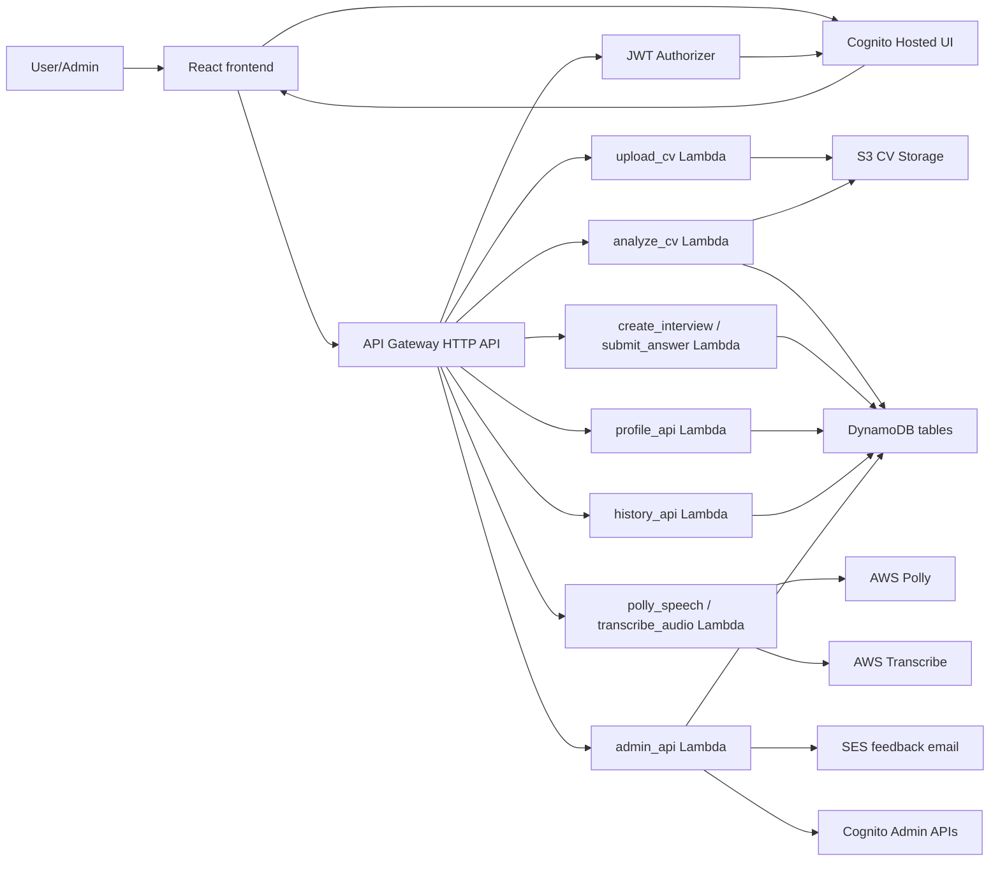

# AWS, Cognito, Admin Console Handover

Tài liệu này gom các phần AWS/auth/admin đã làm để người khác có thể tiếp tục deploy, test và hỏi Codex dễ hơn.

## Kiến trúc hiện tại



## Đã có trong code

- Frontend auth Cognito và demo login fallback: `frontend/src/services/authService.js`
- Gắn JWT access token vào API request: `frontend/src/services/apiClient.js`
- Admin Console: `frontend/src/pages/Admin/Admin.jsx`, `frontend/src/pages/Admin/Admin.css`
- Admin API client: `frontend/src/services/adminApi.js`
- History API client: `frontend/src/services/historyApi.js`
- Backend admin Lambda: `backend/admin_api/lambda_function.py`
- Backend history Lambda: `backend/history_api/lambda_function.py`
- Các Lambda chính đã hỗ trợ lấy user từ Cognito authorizer claims: `upload_cv`, `analyze_cv`, `create_interview`, `submit_answer`, `profile_api`, `polly_speech`, `transcribe_audio`
- Cognito branding assets: `frontend/src/assets/cognito-branding/`
- Script tạo lại ảnh branding: `scripts/generate_cognito_branding_assets.py`

## Cognito branding

Ảnh có sẵn:

- `cognito-background-dark-neon.png`
- `cognito-logo-dark-neon.png`
- `cognito-mark-dark-neon.png`
- `cognito-header-dark-neon.png`
- `cognito-footer-dark-neon.png`

Chạy lại script tạo ảnh:

```bash
npm run brand:cognito
```

Lệnh này dùng Node để tự tìm Python trong máy. Nếu muốn chỉ định Python thủ công:

```powershell
$env:PYTHON="C:\Path\To\python.exe"
npm run brand:cognito
```

Nếu máy khác không nhận lệnh `py`, chạy lệnh dự phòng:

```bash
npm run brand:cognito:python
```

Script cần thư viện `Pillow`. Nếu máy chưa có:

```powershell
py -m pip install pillow
```

## Biến môi trường frontend

Xem mẫu trong `frontend/.env.example`.

Các biến chính:

- `VITE_UPLOAD_CV_API_URL`
- `VITE_ANALYZE_CV_API_URL`
- `VITE_PROFILE_API_URL`
- `VITE_HISTORY_API_URL`
- `VITE_INTERVIEW_API_BASE_URL`
- `VITE_VOICE_API_BASE_URL`
- `VITE_ADMIN_API_BASE_URL`
- `VITE_COGNITO_DOMAIN`
- `VITE_COGNITO_CLIENT_ID`
- `VITE_COGNITO_REDIRECT_URI`
- `VITE_COGNITO_LOGOUT_URI`
- `VITE_COGNITO_SCOPES`

Không commit file `frontend/.env` nếu có giá trị thật.

## AWS đã làm hoặc đã hướng dẫn

- Tạo Cognito User Pool, App Client, Hosted UI.
- Cấu hình callback/logout URL cho local và production.
- Tạo group `user` và `admin`.
- Điều hướng login theo role: admin vào Admin Console, user vào Dashboard.
- Tạo JWT Authorizer cho API Gateway.
- Thêm route `GET /history` trỏ tới `history_api`.
- Thêm backend `admin_api` cho users, CVs, interviews, review queue, audit log, export CSV, feedback email.
- Thêm route `POST /admin/users/action` để admin khóa, mở khóa hoặc xóa tài khoản ứng viên.
- Thêm route `POST /admin/interviews/delete` để admin xóa bản ghi phỏng vấn không cần giữ lại.
- IAM cho `admin_api` cần quyền DynamoDB `Scan`, `GetItem`, `PutItem`, `DeleteItem`, Cognito `ListUsers`, `AdminGetUser`, `AdminListGroupsForUser`, `AdminDisableUser`, `AdminEnableUser`, `AdminDeleteUser`, S3 presigned URL, SES nếu gửi email.
- CloudWatch Logs dùng để debug Lambda/API Gateway.

## Tạm hoãn hoặc cần test tiếp

- CloudFront và WAF tạm hoãn vì AWS account chưa verified để tạo đủ production resources.
- Load Balancer không cần cho React static app nếu deploy bằng S3 + CloudFront.
- SES feedback email vẫn bị giới hạn sandbox nếu recipient chưa verify. Cần xin SES production access.
- Polly/Transcribe voice flow cần test thật toàn bộ từ frontend đến Lambda.
- History đa thiết bị đã có API/hướng đi, nhưng cần test lại sau khi deploy AWS route.

## Checklist deploy tiếp

1. Deploy code mới cho các Lambda trong `backend/*/lambda_function.py`.
2. Tạo hoặc cập nhật route API Gateway:
   - `POST /upload_cv`
   - `POST /analyze_cv`
   - `POST /create_interview`
   - `POST /submit_answer`
   - `GET /history`
   - `GET/POST /profile`
   - `POST /polly_speech`
   - `POST /transcribe_audio`
   - `/admin/*`
   - `POST /admin/users/action`
   - `POST /admin/interviews/delete`
3. Gắn JWT Authorizer cho các route cần bảo vệ.
4. Thêm CORS/OPTIONS cho frontend domain.
5. Cập nhật Lambda environment variables theo từng service.
6. Cập nhật IAM role cho Lambda nếu CloudWatch báo `AccessDenied`.
7. Cập nhật `frontend/.env` theo URL API Gateway và Cognito.
8. Chạy frontend:

```bash
npm run lint
npm run build
npm run dev
```
