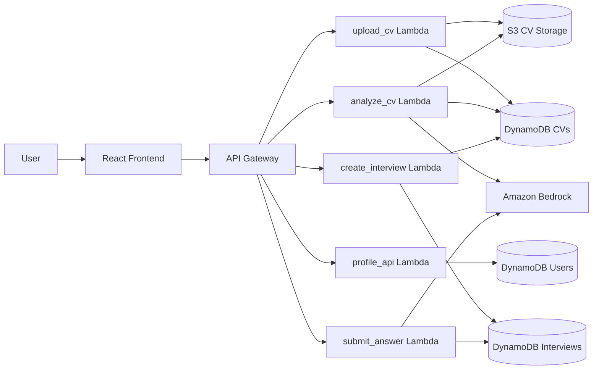
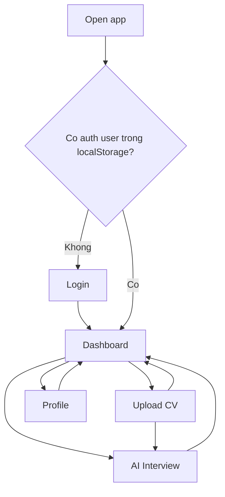
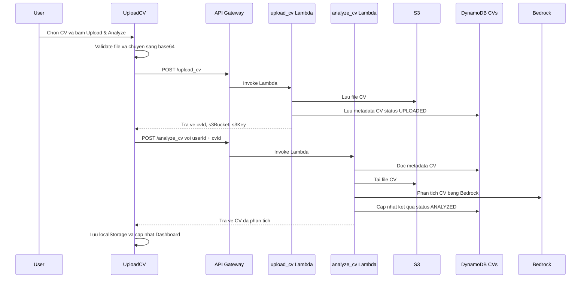
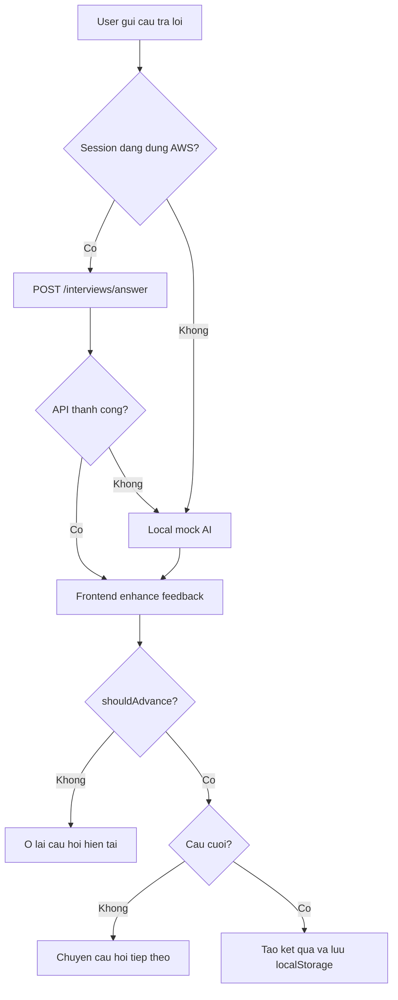

# Luong hoat dong Backend va Frontend

Tai lieu nay tom tat cac chuc nang da lam trong du an Vertex-IntervAI / Talent Graph AI de thanh vien trong nhom nam duoc luong xu ly chinh cua he thong.

## 1. Tong quan he thong

Du an gom 2 phan chinh:

- `frontend/`: ung dung React + Vite hien thi giao dien dang nhap, dashboard, upload CV, phong van AI va profile.
- `backend/`: cac AWS Lambda xu ly API Gateway, S3, DynamoDB va Bedrock.

He thong dang dung user demo mac dinh la `user_demo_001`. Frontend co co che fallback bang `localStorage`, nen ung dung van co the demo khi API AWS bi loi. Khi API hoat dong dung, luong du lieu chinh se di qua API Gateway -> Lambda -> S3/DynamoDB/Bedrock.



## 2. Luong dieu huong frontend

File dieu phoi chinh: `frontend/src/App.jsx`.

1. Khi app khoi dong, frontend doc user tu `localStorage` qua `loadAuthUser()`.
2. Neu chua dang nhap, app hien man hinh `Login`.
3. Sau khi dang nhap thanh cong, app hien `Dashboard`.
4. State chinh trong `App.jsx`:
   - `currentUser`: thong tin user dang dang nhap.
   - `currentPage`: man hinh hien tai.
   - `cvAnalysis`: ket qua phan tich CV, doc tu `talentGraph.cvAnalysis`.
   - `interviewResult`: ket qua phong van, doc tu `talentGraph.interviewResult`.
5. Cac man hinh nhan callback tu `App.jsx`:
   - `onNavigate(page)`: doi man hinh.
   - `onUploadComplete(analysis)`: cap nhat ket qua CV moi.
   - `onInterviewComplete(result)`: cap nhat ket qua phong van moi.
   - `onLogout()`: xoa user dang nhap va quay ve Login.



## 3. Luong dang nhap

Frontend files:

- `frontend/src/pages/Login/Login.jsx`
- `frontend/src/services/authService.js`

Luong xu ly:

1. Man Login co san 2 tai khoan demo:
   - User: `user@talentgraph.ai` / `user123`
   - Admin: `admin@talentgraph.ai` / `admin123`
2. Khi submit form, `loginWithDemoAccount(email, password)` so khop email/password voi danh sach demo.
3. Neu dung, service bo truong `password`, luu user an toan vao `localStorage` voi key `talentGraph.authUser`.
4. `App.jsx` nhan user qua `onLogin(user)` va chuyen ve Dashboard.
5. Logout se goi `logoutAuthUser()` de xoa key `talentGraph.authUser`.

Ghi chu: dang nhap hien tai la demo login phia frontend, chua co backend authentication rieng.

## 4. Luong Dashboard

Frontend file: `frontend/src/pages/Dashboard/Dashboard.jsx`.

Dashboard co nhiem vu tong hop trang thai moi nhat cua ung vien:

- Neu da upload CV, hien thong tin tu `cvAnalysis`.
- Neu chua upload CV, hien du lieu demo `fallbackCvAnalysis`.
- Neu da hoan thanh phong van, hien diem moi tu `interviewResult`.
- Hien cac khoi chinh:
  - CV Score
  - Latest Interview
  - Completed Interviews
  - Average Score
  - Talent Graph radar chart
  - Skill breakdown
  - CV Status
  - AI Recommendation
  - Recent Interviews
  - Quick Actions

Dashboard khong goi API truc tiep. No nhan data tu `App.jsx`, ma data nay duoc nap tu `localStorage` hoac duoc cap nhat sau luong Upload CV / Interview.

## 5. Luong Upload CV va phan tich CV

Frontend files:

- `frontend/src/pages/UploadCV/UploadCV.jsx`
- `frontend/src/services/cvStorage.js`
- `frontend/src/services/cvApi.js`

Backend files:

- `backend/upload_cv/lambda_function.py`
- `backend/analyze_cv/lambda_function.py`

### 5.1 Luong frontend Upload CV

1. User chon hoac keo tha file CV.
2. `validateCvFile(file)` kiem tra:
   - Dinh dang: `pdf`, `doc`, `docx`
   - MIME type hop le neu browser cung cap
   - Kich thuoc toi da: 10 MB
3. Khi bam `Upload & Analyze`, frontend:
   - Chuyen file sang base64 bang `FileReader`.
   - Goi `uploadCvToAws(file, currentUser.userId)`.
   - Neu upload thanh cong, goi tiep `analyzeCvOnAws(uploadedCv)`.
   - Tron ket qua AWS voi mock shape trong `createDashboardAnalysis(...)` de Dashboard luon co day du truong can hien thi.
   - Luu ket qua vao `localStorage` bang key `talentGraph.cvAnalysis`.
   - Goi `onUploadComplete(result)` de `App.jsx` cap nhat state.



### 5.2 Backend `POST /upload_cv`

Lambda: `backend/upload_cv/lambda_function.py`.

Input frontend gui len:

```json
{
  "userId": "user_demo_001",
  "fileName": "candidate.pdf",
  "contentType": "application/pdf",
  "fileContent": "base64..."
}
```

Cac buoc xu ly:

1. Xu ly CORS `OPTIONS`.
2. Chi cho phep method `POST`.
3. Lay `userId`, `fileName`, `fileContent`, `contentType`.
4. Neu thieu `fileName` hoac `fileContent`, tra `400`.
5. Kiem tra extension backend cho phep: `pdf`, `doc`, `docx`, `txt`.
6. Decode base64 va kiem tra kich thuoc <= 10 MB.
7. Tao `cvId` theo dang `cv_<timestamp>_<random>`.
8. Tao S3 key: `cv/{userId}/{cvId}.{extension}`.
9. Upload file len S3 bucket trong env `STORAGE_BUCKET`.
10. Luu item vao DynamoDB table `CVS_TABLE` voi status `UPLOADED`.
11. Tra ve `cv` gom metadata va vi tri file tren S3.

Output chinh:

```json
{
  "message": "CV uploaded successfully",
  "cv": {
    "userId": "user_demo_001",
    "cvId": "cv_...",
    "fileName": "candidate.pdf",
    "fileSize": 123456,
    "contentType": "application/pdf",
    "s3Bucket": "...",
    "s3Key": "cv/user_demo_001/cv_....pdf",
    "status": "UPLOADED"
  }
}
```

### 5.3 Backend `POST /analyze_cv`

Lambda: `backend/analyze_cv/lambda_function.py`.

Input:

```json
{
  "userId": "user_demo_001",
  "cvId": "cv_..."
}
```

Cac buoc xu ly:

1. Xu ly CORS `OPTIONS`.
2. Doc `userId`, `cvId`; neu thieu `cvId`, tra `400`.
3. Lay item CV trong DynamoDB `CVs` bang key `{ userId, cvId }`.
4. Neu khong thay CV, tra `404`.
5. Lay `s3Bucket`, `s3Key`; neu thieu vi tri file, tra `400`.
6. Tai file tu S3.
7. Trich xuat text theo dinh dang:
   - `docx`: doc XML trong file zip.
   - `pdf`: doc stream/literal/hex text tu file PDF.
   - `txt`: decode UTF-8.
8. Neu text doc duoc qua ngan, tra `400` va yeu cau upload PDF/DOCX co text.
9. Goi Bedrock Nova Lite voi prompt yeu cau tra JSON.
10. Neu Bedrock loi hoac tra JSON khong hop le, dung fallback analyzer dua tren keyword.
11. Chuan hoa ket qua: score 0-100, skills, projects, experience, certificates, talentScores, skillGroups.
12. Cap nhat item CV trong DynamoDB voi:
   - `status: ANALYZED`
   - `cvText`
   - `cvScore`
   - `suggestedPosition`
   - `summary`
   - `recommendation`
   - `talentScores`
   - `skillGroups`
   - `analyzedAt`, `updatedAt`
13. Tra ve CV da duoc phan tich.

Ghi chu quan trong: frontend cho upload `.doc`, backend `upload_cv` cung chap nhan `.doc`, nhung `analyze_cv` chi doc text tu `pdf`, `docx`, `txt`. Neu upload `.doc`, buoc phan tich co the bao loi va can chuyen sang `.docx` hoac `.pdf`.

## 6. Luong tao phong van AI

Frontend files:

- `frontend/src/pages/Interview/Interview.jsx`
- `frontend/src/services/interviewApi.js`
- `frontend/src/services/interviewService.js`
- `frontend/src/services/interviewStorage.js`

Backend file:

- `backend/create_interview/lambda_function.py`

### 6.1 Khi vao man Interview

1. `Interview.jsx` tao mot session local ban dau bang `createInterviewSession(cvAnalysis)` de UI co data ngay.
2. Sau do `useEffect` goi `createInterviewOnAws({ cvAnalysis, currentUser })`.
3. Neu AWS thanh cong:
   - Dung session tu backend.
   - `interviewSource = "AWS"`.
   - `apiStatus = "Using AWS Lambda + DynamoDB"`.
4. Neu AWS loi:
   - Giu session local mock.
   - `interviewSource = "Mock AI"`.
   - Hien ly do fallback trong `apiStatus`.

### 6.2 Backend `POST /interviews`

Lambda: `backend/create_interview/lambda_function.py`.

Input frontend gui:

```json
{
  "userId": "user_demo_001",
  "cvId": "cv_...",
  "role": "Frontend Developer Intern",
  "skills": ["React", "Python", "AWS"],
  "projects": ["Talent Graph AI"]
}
```

Cac buoc xu ly:

1. Xu ly CORS `OPTIONS`.
2. Chi cho phep `POST`.
3. Lay `userId`, `cvId`.
4. Neu co `CVS_TABLE` va `cvId` hop le, Lambda doc them CV da phan tich tu DynamoDB.
5. Xac dinh:
   - `role`: tu request hoac `suggestedPosition` trong CV.
   - `skills`: tu request hoac `skills` trong CV.
   - `projects`: tu request hoac `projects` trong CV.
6. Tao 6 cau hoi phong van dua tren role, skills, project va mot so nhom cau hoi ve:
   - gioi thieu ban than
   - ky nang frontend/backend/database/cloud
   - project trong CV
   - dashboard/API
   - debug/learning/feedback
7. Tao `interviewId`.
8. Luu session vao DynamoDB `Interviews` voi:
   - `status: IN_PROGRESS`
   - `questions`
   - `answers: []`
   - `answerAttempts: []`
   - `overallScore: 0`
   - `answeredQuestions: 0`
9. Tra ve `interview`.

Frontend se chuan hoa cau hoi bang `normalizeInterviewQuestions(...)` de hien thi gon hon, vi du thay link GitHub bang ten project.

## 7. Luong tra loi va cham diem phong van

Frontend file: `frontend/src/pages/Interview/Interview.jsx`.

Backend file: `backend/submit_answer/lambda_function.py`.

### 7.1 Luong frontend khi user gui cau tra loi

1. User co the nhap cau tra loi trong chat.
2. User cung co the bam microphone:
   - Browser xin quyen micro.
   - MediaRecorder thu am.
   - Khi dung thu, app hien transcript mock tu `createMockTranscript(questionIndex)`.
   - Hien tai chua co Amazon Transcribe that.
3. Khi gui cau tra loi, frontend them message cua user vao chat.
4. Neu session dang dung AWS, goi `submitAnswerToAws(...)`.
5. Neu AWS loi, chuyen sang `askMockAi(...)`.
6. Sau khi nhan feedback, frontend goi `enhanceInterviewFeedback(...)` de kiem tra them:
   - cau tra loi qua ngan
   - cau tra loi lac de
   - copy lai feedback AI cu
   - thieu vi du project / chi tiet ky thuat / ket qua
7. Neu `shouldAdvance = false`, user phai tra loi lai cau hoi hien tai.
8. Neu `shouldAdvance = true`, app chuyen sang cau hoi tiep theo.
9. Neu het cau hoi, tao ket qua bang `createInterviewResult(...)`, luu vao `localStorage` key `talentGraph.interviewResult`, cap nhat Dashboard qua `onInterviewComplete(result)`.



### 7.2 Backend `POST /interviews/answer`

Input:

```json
{
  "userId": "user_demo_001",
  "interviewId": "interview_...",
  "questionIndex": 0,
  "question": "Question text",
  "answer": "Candidate answer"
}
```

Cac buoc xu ly:

1. Xu ly CORS `OPTIONS`.
2. Chi cho phep `POST`.
3. Kiem tra `interviewId` va `answer`; thieu thi tra `400`.
4. Doc interview trong DynamoDB `Interviews`.
5. Kiem tra `questionIndex` hop le.
6. Cham diem cau tra loi:
   - Dau tien tao local evaluation de bat cac truong hop yeu ro rang.
   - Goi Bedrock de cham bang prompt phong van.
   - Neu Bedrock loi, dung fallback evaluator.
   - Neu local evaluator thay cau tra loi qua yeu nhung Bedrock cham cao, backend uu tien local evaluator de tranh qua cau hoi sai.
7. Tao `answer_record` gom:
   - `questionIndex`
   - `question`
   - `answer`
   - `score`
   - `level`
   - `feedback`
   - `strengths`
   - `improvements`
   - `shouldAdvance`
   - `aiProvider`
   - `answeredAt`
8. Cap nhat interview:
   - Luon them vao `answerAttempts` de luu moi lan thu.
   - Chi them vao `answers` neu `shouldAdvance = true`.
   - Tinh lai `answeredQuestions`.
   - Tinh `overallScore` trung binh cac cau da pass.
   - Neu da tra loi du so cau, doi `status = COMPLETED` va them `completedAt`.
9. Ghi lai toan bo interview vao DynamoDB.
10. Tra ve `evaluation`, `answer`, `interview`.

## 8. Luong Profile

Frontend files:

- `frontend/src/pages/Profile/Profile.jsx`
- `frontend/src/services/profileApi.js`

Backend file:

- `backend/profile_api/lambda_function.py`

### 8.1 Luong frontend Profile

1. Khi vao Profile, app nap profile tu `localStorage` theo key `talentGraph.profile.<userId>`.
2. Sau do goi `getProfileFromAws(userId)`.
3. Neu AWS co profile, merge vao state va hien `Synced from AWS`.
4. Neu AWS loi hoac chua co profile, hien `Saved locally`.
5. User bam `Edit Profile` de sua thong tin.
6. Khi bam `Save`:
   - Luu localStorage truoc.
   - Goi `saveProfileToAws(profile, userId)`.
   - Neu AWS thanh cong, merge response va hien `Saved to AWS`.
   - Neu AWS loi, van giu ban local va hien `Saved locally`.

### 8.2 Backend `GET /profile`

Query:

```text
GET /profile?userId=user_demo_001
```

Cac buoc:

1. Xu ly CORS `OPTIONS`.
2. Lay `userId` tu query, neu khong co dung `user_demo_001`.
3. Doc item trong DynamoDB `Users`.
4. Neu khong co, tra `404`.
5. Neu co, tra `{ "profile": profile }`.

### 8.3 Backend `POST /profile`

Input:

```json
{
  "userId": "user_demo_001",
  "fullName": "Nguyen Huy Dat",
  "headline": "Frontend Developer Intern",
  "email": "user@talentgraph.ai",
  "phone": "...",
  "location": "...",
  "university": "...",
  "github": "...",
  "linkedin": "...",
  "portfolio": "...",
  "goal": "..."
}
```

Cac buoc:

1. Chi luu cac field nam trong `ALLOWED_FIELDS`.
2. Trim string truoc khi luu.
3. Neu profile da co `createdAt`, giu nguyen `createdAt`.
4. Cap nhat `updatedAt`.
5. Ghi item vao DynamoDB `Users`.
6. Tra ve profile da luu.

## 9. Cac endpoint va bien moi truong

Frontend doc endpoint tu `.env` hoac dung default hard-code trong service:

```text
VITE_UPLOAD_CV_API_URL=https://.../default/upload_cv
VITE_ANALYZE_CV_API_URL=https://.../default/analyze_cv
VITE_PROFILE_API_URL=https://.../default/profile
VITE_INTERVIEW_API_BASE_URL=https://.../default
```

Backend Lambda can cac bien moi truong:

```text
upload_cv:
  CVS_TABLE
  STORAGE_BUCKET

analyze_cv:
  CVS_TABLE
  BEDROCK_MODEL_ID
  BEDROCK_REGION

profile_api:
  USERS_TABLE

create_interview:
  INTERVIEWS_TABLE
  CVS_TABLE

submit_answer:
  INTERVIEWS_TABLE
  BEDROCK_MODEL_ID
  BEDROCK_REGION
```

Route API Gateway dang dung:

```text
POST /upload_cv
POST /analyze_cv
GET  /profile
POST /profile
POST /interviews
POST /interviews/answer
```

Tat ca route can bat CORS hoac them method `OPTIONS`.

## 10. Cac table/storage chinh

### DynamoDB `CVs`

Key du kien:

- Partition key: `userId`
- Sort key: `cvId`

Du lieu quan trong:

- Metadata upload: `fileName`, `fileSize`, `contentType`, `s3Bucket`, `s3Key`
- Trang thai: `UPLOADED`, `ANALYZED`
- Ket qua AI: `cvScore`, `suggestedPosition`, `summary`, `skills`, `projects`, `experience`, `certificates`, `recommendation`, `talentScores`, `skillGroups`
- Thoi gian: `createdAt`, `updatedAt`, `analyzedAt`

### DynamoDB `Users`

Key du kien:

- Partition key: `userId`

Du lieu quan trong:

- `fullName`, `headline`, `email`, `phone`, `location`, `university`
- `github`, `linkedin`, `portfolio`
- `goal`
- `createdAt`, `updatedAt`

### DynamoDB `Interviews`

Key du kien:

- Partition key: `userId`
- Sort key: `interviewId`

Du lieu quan trong:

- `cvId`, `role`, `skills`, `projects`
- `questions`
- `answers`: cac cau da pass
- `answerAttempts`: tat ca lan gui cau tra loi, ke ca lan khong pass
- `overallScore`, `answeredQuestions`, `totalQuestions`
- `status`: `IN_PROGRESS` hoac `COMPLETED`
- `createdAt`, `updatedAt`, `completedAt`

### S3

CV duoc luu theo pattern:

```text
cv/{userId}/{cvId}.{extension}
```

## 11. Co che fallback va nhung diem can noi ro khi demo

- Login hien tai la demo frontend, chua co backend auth that.
- Dashboard co fallback demo data neu chua co CV/interview result.
- Upload CV can API AWS that; neu API loi thi hien message loi, khong tu tao mock analysis trong catch.
- Interview co fallback local rat manh:
  - Neu tao interview AWS loi, app dung cau hoi local.
  - Neu submit answer AWS loi, app dung local mock AI.
  - Voice recording hien tai chi lay mock transcript, chua tich hop Transcribe that.
  - Text-to-speech dang dung browser `speechSynthesis`, chua dung Amazon Polly that.
- Profile luu localStorage truoc, sau do moi sync AWS. Vi vay profile van giu duoc tren may demo neu AWS loi.
- Bedrock co fallback trong backend:
  - CV analysis dung keyword analyzer neu Bedrock loi.
  - Interview scoring dung local evaluator neu Bedrock loi hoac cau tra loi qua yeu.

## 12. Luong end-to-end de thanh vien nhom de hinh dung

1. User dang nhap bang tai khoan demo.
2. User vao Dashboard de xem tong quan.
3. User vao Upload CV, chon file hop le va bam `Upload & Analyze`.
4. Frontend gui file base64 len `POST /upload_cv`.
5. Backend luu file vao S3 va metadata vao DynamoDB `CVs`.
6. Frontend goi `POST /analyze_cv`.
7. Backend doc file tu S3, trich text, phan tich bang Bedrock/fallback, cap nhat `CVs`.
8. Frontend luu ket qua vao localStorage va cap nhat Dashboard.
9. User vao AI Interview.
10. Frontend tao session local tam thoi, sau do thu tao session AWS qua `POST /interviews`.
11. Backend tao cau hoi dua tren CV/skills/projects va luu vao DynamoDB `Interviews`.
12. User tra loi tung cau bang chat hoac transcript mock tu microphone.
13. Frontend gui cau tra loi qua `POST /interviews/answer`.
14. Backend cham diem bang Bedrock/fallback, cap nhat interview trong DynamoDB.
15. Neu cau tra loi du diem, frontend chuyen cau tiep theo; neu khong, user tra loi lai.
16. Khi het cau hoi, frontend tao final result, luu localStorage va cap nhat Dashboard.
17. User co the vao Profile de sua thong tin, luu local va sync DynamoDB `Users`.

## 13. File map nhanh

```text
frontend/src/App.jsx
  Dieu phoi auth, navigation, cvAnalysis, interviewResult.

frontend/src/services/authService.js
  Demo login va localStorage auth.

frontend/src/services/cvApi.js
  Goi /upload_cv va /analyze_cv.

frontend/src/services/cvStorage.js
  Validate CV, mock analysis shape, localStorage CV.

frontend/src/services/interviewApi.js
  Goi /interviews va /interviews/answer.

frontend/src/services/interviewService.js
  Tao cau hoi local, mock AI, feedback coaching, speechSynthesis.

frontend/src/services/interviewStorage.js
  Tao final result va localStorage interview result.

frontend/src/services/profileApi.js
  Goi GET/POST /profile.

backend/upload_cv/lambda_function.py
  Upload CV len S3 va luu metadata vao DynamoDB.

backend/analyze_cv/lambda_function.py
  Doc CV tu S3, trich text, goi Bedrock/fallback, cap nhat CV analysis.

backend/profile_api/lambda_function.py
  Doc/luu profile user vao DynamoDB Users.

backend/create_interview/lambda_function.py
  Tao session phong van va luu DynamoDB Interviews.

backend/submit_answer/lambda_function.py
  Cham cau tra loi, luu attempt/answer, tinh diem va trang thai interview.
```
